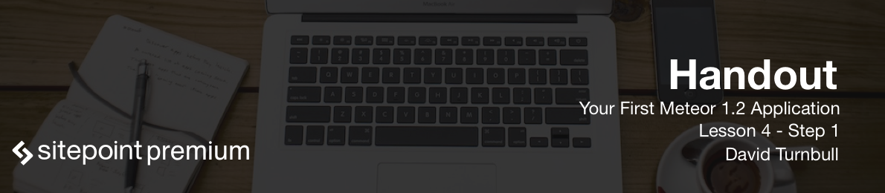

# Introduction

One of the most difficult parts of teaching people how to build things with Meteor, is deciding when to introduce certain ideas. There are a number of topics we have to cover, but the order in which we talk about these topics can drastically affect whether or not you retain any of the details. One mistake a lot of teachers make, for instance, is starting a book or a course by showing students how to build an interface as soon as possible. This approach is fun because students can see the visual results of their code, which allows students to feel like they're making quick progress. But this approach also introduces a couple of problems:

* It's difficult to truly grasp anything relating to the front-end, if you're not familiar with what's happening on the back-end.
* If we talk about the front-end first, we'll have to back-trackin the next chapter anyway, so any feeling of quick progress will be short lived.

# Databases

Because of this, we're going to start by talking about how to create and manage a database within our project. This isn't the most exciting topic in the world, but if we spend a few minutes covering the basics, we'll have a much stronger foundation for the rest of the course. Then it'll be much easier for us to enjoy the fun stuff.